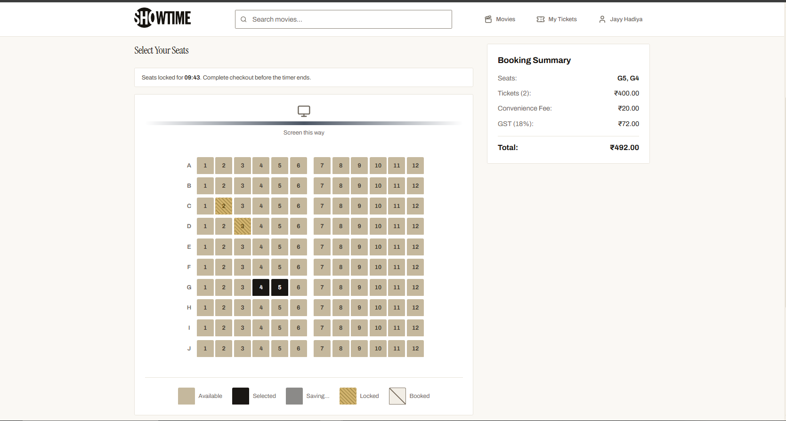
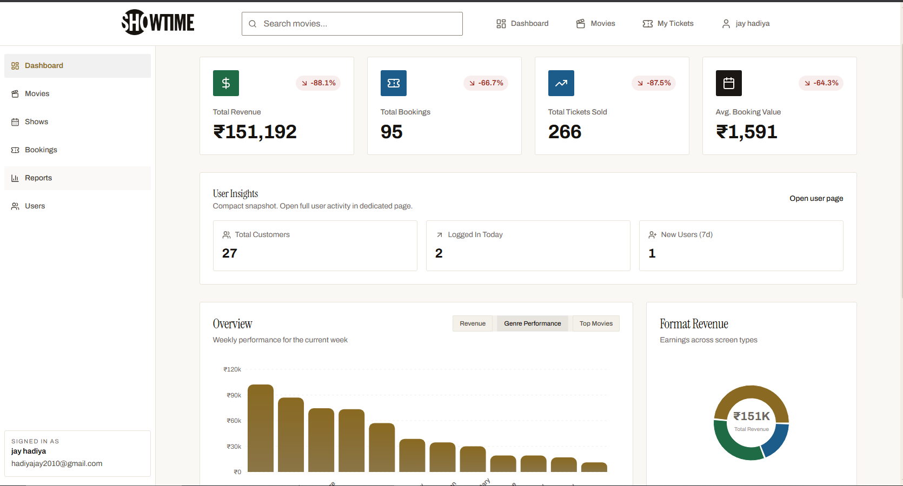
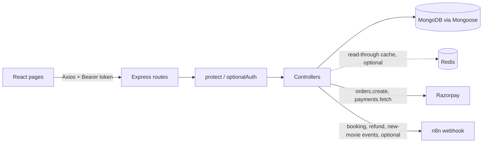

# ShowTimeX

[](https://github.com/jayy-codes07/ShowTimeX-cinema-management-system/actions/workflows/ci.yml)

A movie ticket booking web app: customers pick a showtime, hold seats for a few minutes, pay through Razorpay (test mode) and download a ticket; admins manage movies, shows, bookings and reports.

## Demo

- **Live app:** https://showtimexproject.vercel.app/
- **Backend API:** https://showtimex.onrender.com/ (health check: https://showtimex.onrender.com/api/health)
- **Demo customer:** email `demo.customer@example.com` / password `Demo@123`
- **Demo admin:** email `demo.admin@example.com` / password `Admin@123`
- These are demo accounts with fake data only. Payments run in Razorpay test mode; no money moves. Razorpay's published test card list includes Visa `4100 2800 0000 1007` with any future expiry and any CVV (verify before use at https://razorpay.com/docs/payments/payments/test-card-details/).
- The backend runs on a free Render plan and sleeps when idle, so the first request after a quiet spell can take up to a minute.

To create the same demo accounts in your own database:

```bash
cd backend
npm run seed:users                # dry run: prints the target host, writes nothing
SEED_ADMIN_PASSWORD=... SEED_CUSTOMER_PASSWORD=... npm run seed:users -- --confirm
```

The script only upserts the two demo users; it never creates or touches movies, shows or bookings, and passwords come only from those two variables.

## Try it in 60 seconds

1. Open https://showtimexproject.vercel.app/ and log in as `demo.customer@example.com` / `Demo@123`.
2. Pick a movie under Now Showing, then a showtime that is more than an hour away.
3. Select one or two free seats (rows A to C are usually open). A 10-minute hold timer starts; the seats turn locked for everyone else.
4. Continue to Checkout and pay with the Razorpay test Visa `4100 2800 0000 1007`, any future expiry, any CVV.
5. Open My Tickets and download the PDF ticket. Log in as `demo.admin@example.com` / `Admin@123` to see the booking under Admin → Bookings.
6. In a terminal, run the same request twice and compare the header:

```bash
curl -sI https://showtimex.onrender.com/api/movies/now-showing | grep -i x-cache   # X-Cache: MISS
curl -sI https://showtimex.onrender.com/api/movies/now-showing | grep -i x-cache   # X-Cache: HIT
```

The backend sleeps on Render's free plan, so the very first request can take up to a minute.

**By the numbers:** 36 API routes, 6 of them cached, 62 backend tests (2 of them race two writers for one seat), 0 card details stored.

| Home | Seat map | Admin dashboard |
|---|---|---|
|  |  |  |

## Key features

- **Customer accounts with JWT auth.** Register and log in; passwords are bcrypt-hashed in a Mongoose pre-save hook. Login returns a 7-day Bearer token; `protect` loads the user from MongoDB on every request and rejects deactivated accounts, `adminOnly` gates the admin routes, and public registration always creates a `customer`.
- **OTP password reset.** A 6-digit code from `crypto.randomInt` is stored SHA-256 hashed with a 10-minute expiry and emailed through Nodemailer (an Ethereal test inbox when no SMTP host is configured).
- **Seat holds with a countdown.** Selecting seats locks them for the caller (default 10 minutes, 1 to 30 allowed) and other users see them as locked. The seat map shows booked, held and selected seats, enforces a 10-seat cap that the server also enforces, and bookings close 60 minutes before showtime.
- **Double booking prevented by one conditional update.** Locking and confirming seats are each a single `Show.updateOne` whose filter rejects the document if any requested seat is already booked or held by another user. Two concurrent requests for the same seat get exactly one success and one 409; a test proves it.
- **Payment verification bound to the booking.** The server creates the Razorpay order from the stored total, saves the order id on the booking, checks the HMAC-SHA256 signature, then fetches the payment from Razorpay and requires the same order id, status `captured` and the exact amount in paise before writing seats.
- **Server-side pricing.** Totals come from the show price in the database plus a 5% convenience fee and 18% tax; prices sent by the client are ignored.
- **Per-user booking access.** Reading, cancelling, creating a payment order and verifying a payment all return 403 for anyone but the booking's owner; admins can read any booking. Show responses never expose who holds a lock.
- **Cancellation with tiered refund eligibility.** Cancelling records 90%, 70% or 50% of the total as refund-eligible depending on hours before the show; an admin approves or declines it from the bookings page.
- **Admin panel.** Create movies with TMDB poster lookup or a pasted URL, bulk-schedule shows across a date range and time slots, browse all bookings with filters and pagination, see user insights, and read revenue, ticket, top-movie, format and genre reports with period-over-period change, built with MongoDB aggregation.
- **Ticket PDF.** `@react-pdf/renderer` produces a downloadable ticket with a QR image of the booking id.
- **Hardened Express app.** Helmet, a CORS allow-list from `CLIENT_URL`, rate limiting on login, register and OTP routes, regex-escaped search input, and generic 500 responses with no stack traces.
- **Optional Redis read-through cache.** The six public list endpoints (movie list, search, now showing, coming soon, show list, shows by movie) are cached: movie lists for 300 s, show lists for 30 s. Keys carry a version counter that is bumped on every admin movie or show write, seat lock or unlock, confirmed payment, cancellation and refund, so an admin edit is visible immediately despite the longer TTL. Every response carries `X-Cache: HIT`, `MISS` or `BYPASS`. Without `REDIS_URL`, or when Redis is unreachable, the API logs one warning and serves everything from MongoDB. The seat map endpoint and anything that depends on who is asking are never cached.

## Tech stack

- **Frontend:** React 18, Vite 7, React Router 6, Redux Toolkit + react-redux (auth, catalogue lists), Context API (booking flow), Tailwind CSS 3, Framer Motion, Recharts, @react-pdf/renderer, Axios, react-hot-toast
- **Backend:** Node.js 20, Express 4, Mongoose 8, jsonwebtoken, bcryptjs, express-validator, helmet, express-rate-limit, Nodemailer, Razorpay SDK, node-redis
- **Database:** MongoDB; optional Redis for the read-through cache
- **Tooling:** npm, nodemon, ESLint, Node test runner with supertest and mongodb-memory-server, Docker and Docker Compose, GitHub Actions

## Architecture

The React frontend is a pure client of the API. Pages read the session from a Redux auth slice (persisted in `localStorage` under the same keys as before), the home page lists come from a movies slice, and the booking flow keeps its own context. A shared Axios instance gets the token from the store through a getter, attaches it as a Bearer header and redirects to `/login` on 401; every page is loaded lazily by route. Express routes pass through `protect` (or `optionalAuth` on public show routes, so a logged-in viewer sees their own held seats). Controllers validate input, run Mongoose queries, and answer with a `{ success, message, ... }` envelope. Seat state lives inside each show document as `bookedSeats` and time-limited `seatLocks`, which is what lets a single-document conditional update settle seat conflicts without transactions or Redis. Redis, when configured, only caches the public list responses; it plays no part in seat locking.



```
backend
  app.js            Express app, middleware, route mounting (no .env, no listen; used by tests)
  server.js         Local/Render entrypoint: load .env, connect to DB, listen; exported for serverless hosts
  config/db.js      connectDB and the cached ensureDB()
  routes/           auth, movies, shows, bookings, payments, admin, tmdb
  controllers/      request handlers and validation
  models/           User, Movie, Show, Booking
  middleware/       protect (JWT), adminOnly, optionalAuth
  utils/            seatLocks (conflict filter, lock, confirm), cache (optional Redis read-through), razorpay, strings, logger, sendEmail
  tests/            API tests (node:test + supertest + mongodb-memory-server)
  seed.js           idempotent demo seed (--users-only, --confirm)
frontend/src
  pages/            Visitor (home, movies, search), Customer (payment, tickets, profile), Admin (dashboard, movies, shows, bookings, reports, users)
  components/       Booking (seat map, booking form, receipt, ticket PDF), Admin charts, Common (navbar, protected route), UI
  store/            Redux Toolkit: authSlice (session), moviesSlice (now showing, coming soon)
  hooks/            useAuth (same surface the old context had)
  context/          BookingContext (selected show and seats)
  services/         api.js (Axios instance with injected token getter), authService, movieService
  utils/            constants (endpoints, seat config), validators, formatDate
```

## Notable decisions

- **Seat conflicts are settled by the database.** Each seat write carries a `$nor` filter over the requested seats: none may be in `bookedSeats`, and none may be in another user's `seatLocks` entry with a future `expiresAt`. MongoDB applies filter and update atomically per document, so the losing request sees `matchedCount === 0` and gets a 409. The booking is saved as confirmed only after that update succeeded.
- **Verification is stricter than a signature check.** A valid signature only proves an order/payment pair came from Razorpay. Comparing the signed order id with `booking.razorpayOrderId`, and the fetched amount and status with the booking, stops a cheap payment from confirming an expensive booking. The SDK sits behind `utils/razorpay.js` so tests can stub it.
- **Cache invalidation by version counter, not key scanning.** Each cache key embeds a per-group version number; an admin write, seat lock, confirmed payment or cancellation just increments that number, so invalidation is one O(1) command, old entries expire on their own, and nothing ever scans or flushes the Redis instance (which may be shared). The cache fails open: a down Redis costs one warning, not an outage.
- **The seat map is never cached.** `GET /shows/:id` and anything containing the caller's own held seats go straight to MongoDB, and show lists are cached only for anonymous requests, so no user can ever see another user's holds through the cache.
- **Token handling.** The token is returned in the login JSON and kept in `localStorage`; Axios adds it as a Bearer header and clears storage and redirects on any 401. There are no cookies and no refresh token.
- **Errors.** Controllers return fixed messages on 500 and log the error; the global handler forwards messages only for 4xx errors such as malformed JSON and never includes a stack.
- **Serverless-friendly connection.** `ensureDB()` caches the connection promise and is also called by a gate in front of the data routes, so `server.js` can be imported directly by a serverless host while `/api/health` stays reachable when the database is down.
- **Posters are URLs, not uploads.** Images come from the TMDB lookup proxy or a pasted link; there is no file upload, which keeps the API usable on read-only filesystems.
- **Movie status is computed from dates.** "Now showing", "coming soon" and "ended" come from `releaseDate` and `endDate` at request time rather than a stored flag.
- **Single theme.** The app ships one light theme; the theme context is a no-op kept so earlier components still work.

## Getting started

Requires Node.js 20+ and a MongoDB instance.

```bash
# Backend
cd backend
npm install
cp .env.example .env   # then fill in the values described below
npm run dev            # nodemon on http://localhost:5000

# Frontend (second terminal)
cd frontend
npm install
cp .env.example .env   # points at http://localhost:5000/api
npm run dev            # http://localhost:5173
```

| Variable | Where | Purpose |
|---|---|---|
| `MONGO_URI` | backend | MongoDB connection string |
| `PORT` | backend | HTTP port (defaults to 5000) |
| `NODE_ENV` | backend | `development` or `production` |
| `JWT_SECRET` / `JWT_EXPIRE` | backend | Token signing secret and lifetime (defaults to `7d`) |
| `CLIENT_URL` | backend | Frontend origin for the CORS allow-list, e.g. `https://showtimexproject.vercel.app`, no trailing slash; several origins may be comma-separated |
| `RAZORPAY_KEY_ID` / `RAZORPAY_KEY_SECRET` | backend | Razorpay test-mode keys |
| `TMDB_API_KEY` | backend | Optional. Enables the poster lookup proxy |
| `SMTP_HOST` / `SMTP_PORT` / `SMTP_EMAIL` / `SMTP_PASSWORD` / `FROM_NAME` / `FROM_EMAIL` | backend | Optional. OTP email; without `SMTP_HOST` an Ethereal test inbox is used |
| `N8N_WEBHOOK_URL` | backend | Optional. Automation webhooks for booking, refund and new-movie events |
| `SEED_ADMIN_PASSWORD` / `SEED_CUSTOMER_PASSWORD` | backend | Seed only. Demo account passwords |
| `SEAT_LOCK_MINUTES` / `MIN_BOOKING_LEAD_MINUTES` / `SHOW_TIMEZONE_OFFSET_MINUTES` | backend | Optional. Defaults 10, 60, 330 |
| `AUTH_RATE_LIMIT_MAX` / `AUTH_RATE_LIMIT_WINDOW_MINUTES` | backend | Optional. Defaults 20 requests per 15 minutes per IP |
| `REDIS_URL` | backend | Optional. Enables the read-through cache. docker-compose points it at the bundled Redis; in production use a TCP `rediss://` URL (for Upstash: the connection string on the database page, not the REST URL) |
| `CACHE_TTL_MOVIES_SECONDS` / `CACHE_TTL_SHOWS_SECONDS` | backend | Optional. Cache lifetime of movie lists (default 300) and show lists (default 30) |
| `CACHE_TTL_SECONDS` | backend | Optional. Fallback lifetime for both groups when the specific variable is unset |
| `CACHE_KEY_PREFIX` | backend | Optional. Key prefix (default `showtimex:`); change it when several apps share one Redis |
| `VITE_API_BASE_URL` | frontend | Base URL of the API, including `/api` |
| `VITE_RAZORPAY_KEY` | frontend | Razorpay publishable key id; there is no fallback |

Then register through the app or run `npm run seed:users -- --confirm` in `backend` (see Demo above). Movies and shows are added through the admin panel.

### Run everything with Docker Compose

```bash
cp backend/.env.example backend/.env   # fill in JWT_SECRET, RAZORPAY_*, CLIENT_URL at least
docker compose up --build              # API on http://localhost:5000, MongoDB on 27017, Redis on 6379
docker compose ps                      # api, mongo and redis report "healthy"
docker compose down -v                 # stop and wipe the data volumes
```

The compose file overrides `MONGO_URI` and `REDIS_URL` for the `api` service, so the localhost values in `.env` keep working for `npm run dev`; with compose the API caches through the bundled Redis. The frontend is not part of the compose file; run it with `npm run dev` and `VITE_API_BASE_URL=http://localhost:5000/api`.

## API overview

All paths are prefixed with `/api`. "Auth" means a valid token is required; "owner" means the booking's user.

| Method | Path | Auth | Purpose |
|---|---|---|---|
| POST | `/auth/register` | no, rate limited | Create customer account |
| POST | `/auth/login` | no, rate limited | Login, returns token |
| POST | `/auth/forgotpassword` | no, rate limited | Email a reset OTP |
| PUT | `/auth/resetpassword` | no, rate limited | Reset password with OTP |
| GET | `/auth/profile` | yes | Current user |
| PUT | `/auth/update-profile` | yes | Update name, phone, password |
| GET | `/movies`, `/movies/:id`, `/movies/search?query&genre&language`, `/movies/now-showing`, `/movies/coming-soon` | no | Catalogue; the four list routes are cached¹ |
| POST / PUT / DELETE | `/movies`, `/movies/:id` | admin | Manage movies (poster and backdrop are URLs) |
| GET | `/shows?date&theater&movieId`, `/shows/:id`, `/shows/movie/:movieId?date` | no, optional token | Showtimes and seat state; held seats of the caller when logged in. The two list routes are cached¹ for anonymous requests only; `/shows/:id` never is |
| POST / PUT / DELETE | `/shows`, `/shows/:id` | admin | Bulk-create, update, soft-delete shows |
| POST | `/shows/:id/lock`, `/shows/:id/unlock` | yes | Hold or release seats |
| POST | `/bookings/create` | yes | Create a pending booking (server computes the total) |
| GET | `/bookings/user` | yes | Caller's bookings |
| GET | `/bookings/:id` | owner or admin | One booking |
| DELETE | `/bookings/:id/cancel` | owner | Cancel and record refund eligibility |
| GET | `/bookings` | admin | All bookings with filters and pagination |
| POST | `/payments/create` | owner | Create the Razorpay order |
| POST | `/payments/verify` | owner | Verify payment and confirm seats |
| GET | `/admin/stats`, `/admin/reports?startDate&endDate`, `/admin/bookings`, `/admin/users` | admin | Reporting |
| PATCH | `/admin/bookings/:id/refund` | admin | Approve or decline a refund (status only) |
| POST | `/admin/bookings/:id/resend-ticket` | admin | Resend the ticket email through n8n |
| GET | `/tmdb/search?title` | no | Poster lookup proxy |
| GET | `/health` | no | Liveness check; also reports `cache: { driver, status }` |

¹ Cached responses carry `X-Cache: HIT`, fresh ones `MISS`, and `BYPASS` means the cache was skipped (no Redis, Redis down, or a token on a show list).

## Testing and deployment

- **Tests:** `cd backend && npm test` runs 62 tests with Node's built-in test runner against an in-memory MongoDB; neither Docker, Redis nor a Razorpay account is needed, and the Razorpay client is stubbed. Locally 61 run and 1 is skipped (the real-Redis smoke test, enabled by `TEST_REDIS_URL`); in CI all 62 run. They cover register and login, forced customer role, 401 for missing, garbage and forged tokens, the profile hiding sensitive fields (5); two parallel confirmations and two parallel locks for one seat producing exactly one winner, locking a booked seat, merging the caller's own locks, confirmation clearing the lock (5); server-side totals, the 10-seat cap, a seat held by another user, IDOR on read and cancel, owner and admin reads, customers blocked from admin routes, unlock scope (7); wrong-owner 403 on order and verify (4); order id stored, bad signature, order mismatch, amount mismatch, non-captured status, gateway failure leaving the booking pending, a matching payment confirming seats (7); regex metacharacters in search and filters, CORS allow-list, helmet headers (5); rate limiting (1); generic 500 bodies and malformed JSON (3); URL-only posters (3); health and harness (3); seed dry run, idempotency, refusal without passwords, and the users-only seed with real logins (8); cache miss then hit, movie lists using the longer TTL, invalidation after an admin write and after a seat lock, no per-user data in cached bodies, the seat map staying uncached, health reporting the driver (7); an unreachable Redis producing exactly one warning, `BYPASS` responses and an `unavailable` health status (3); a real Redis round trip (1). The frontend has no unit tests; it is checked by `npm run lint` and `npm run build`.
- **CI:** `.github/workflows/ci.yml` runs on every push and pull request. Backend job: `npm ci`, `npm test` with a `redis:7-alpine` service container (used by the real-Redis test through `TEST_REDIS_URL`) and a cached MongoDB binary. Frontend job: `npm ci`, `npm run lint`, `npm run build`. Both jobs are limited to 10 minutes.
- **Docker:** `backend/Dockerfile` builds a `node:20-alpine` image with production dependencies only, runs as the `node` user and starts `node server.js` on port 5000. The root `docker-compose.yml` runs that image with MongoDB and Redis, with healthchecks and named volumes. There is no Dockerfile for the frontend.
- **Hosting:** the frontend is on Vercel (`frontend/vercel.json` rewrites every path to the SPA) and the backend on Render running `node server.js`.

## Known limitations

- No Razorpay webhook. Confirmation depends on the browser calling `/api/payments/verify` after checkout; if the tab closes first, the booking stays pending and must be reconciled by hand.
- If a seat hold expires and another user takes the seat before the payment is verified, verify returns 409, no seats are written, and the customer must be refunded manually.
- Refunds are status-only; no Razorpay refund API call is made.
- If the booking save fails right after the seat update succeeded, the seats are booked without a confirmed booking. This is logged for manual reconciliation and not covered by tests.
- QR codes are plain booking ids from a third-party image service, not signed, with no scan endpoint.
- Rate limiting is in-process memory, so it is per instance; it does not use Redis.
- Seat holds expire by time without a write, so an anonymous show list may count an already expired hold for up to 30 seconds. The seat map itself is never cached.
- The TMDB proxy route has no authentication.

## Roadmap

1. Razorpay webhook with signature verification and idempotent confirmation, then real refunds through the refund API.
2. Signed QR tickets with an admin scan endpoint that marks a ticket used once.
3. Frontend unit tests for the Redux slices.

## Author

**Hadiya Jay** · GitHub [jayy-codes07](https://github.com/jayy-codes07) · LinkedIn [hadiya-jay-b48aa8325](https://www.linkedin.com/in/hadiya-jay-b48aa8325) · [hadiyajay2010@gmail.com](mailto:hadiyajay2010@gmail.com)
