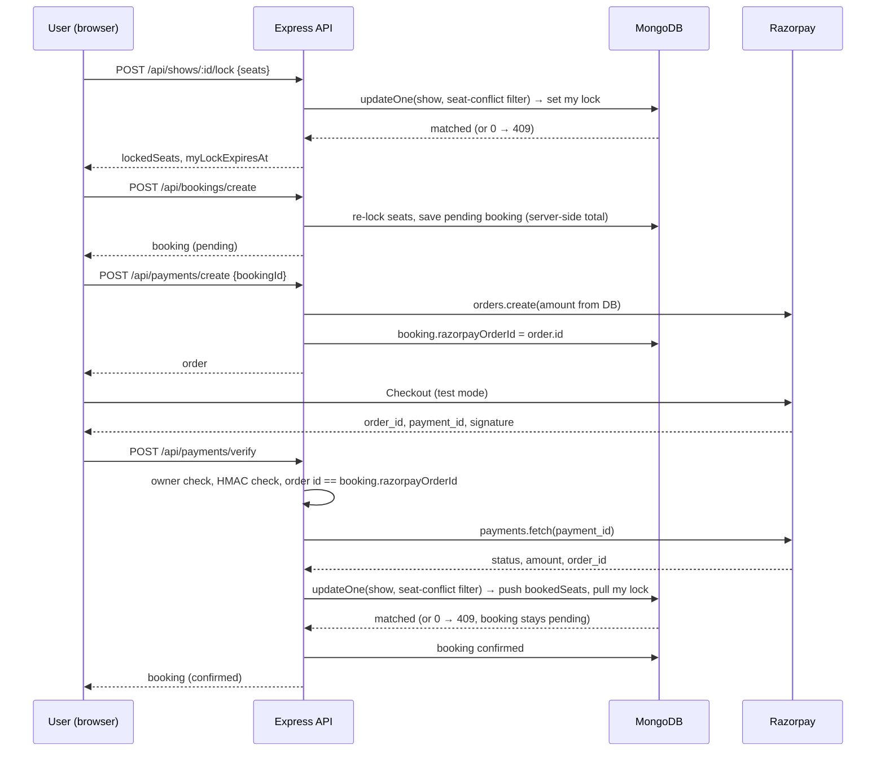

# ShowTimeX

A full-stack movie ticket booking app: browse movies and showtimes, hold seats for a short window, pay with Razorpay (test mode), and download a ticket. Admins manage movies and shows and see revenue reports.

Stack: React 18 + Vite + Tailwind (frontend), Node 20 + Express 4 + Mongoose 8 (backend), MongoDB, Razorpay.

## Live demo

- Frontend: `<LIVE_FRONTEND_URL>`
- API health: `<LIVE_API_URL>/api/health`
- Demo customer: `demo.customer@example.com` / `<DEMO_PASSWORD>`
- Demo admin: `demo.admin@example.com` / `<DEMO_PASSWORD>`

Payments run in Razorpay **test mode** only. Use a Razorpay test card from [their test-card list](https://razorpay.com/docs/payments/payments/test-card-details/), for example Visa `4100 2800 0000 1007` with any future expiry and any CVV. No real money moves.

## Screenshots

- `<screenshot: home page>`
- `<screenshot: seat map with held seats>`
- `<screenshot: admin dashboard>`

## Features (each line points at the code that implements it)

- **JWT auth with roles**: bcrypt-hashed passwords, 7-day tokens, `protect` and `adminOnly` middleware, registration always creates a `customer` ([backend/middleware/authMiddleware.js](backend/middleware/authMiddleware.js), [backend/controllers/authController.js](backend/controllers/authController.js)).
- **OTP password reset**: 6-digit code from `crypto.randomInt`, stored SHA-256 hashed, 10-minute expiry ([backend/models/User.js](backend/models/User.js)).
- **Seat holds**: a user locks seats for 1–30 minutes (default 10) while paying; other users see them as locked ([backend/controllers/showController.js](backend/controllers/showController.js) `lockSeats`, [backend/utils/seatLocks.js](backend/utils/seatLocks.js)).
- **Race-safe seat writes**: locking and final confirmation are single conditional `updateOne` calls; two concurrent writers for the same seat get exactly one success ([backend/utils/seatLocks.js](backend/utils/seatLocks.js) `seatConflictFilter`, `acquireSeatLock`, `confirmSeats`).
- **Server-side pricing**: totals come from the show price in the database plus a 5% convenience fee and 18% tax; client-sent prices are ignored ([backend/models/Booking.js](backend/models/Booking.js) `calculateTotal`).
- **Razorpay checkout bound to the booking**: the server creates the order from the stored amount, stores the order id on the booking, verifies the HMAC-SHA256 signature, then fetches the payment from Razorpay and checks order id, `captured` status and amount before confirming ([backend/controllers/bookingController.js](backend/controllers/bookingController.js) `createRazorpayOrder`, `verifyPayment`).
- **Ownership checks**: read, cancel, order creation and verification all refuse bookings that belong to someone else ([backend/controllers/bookingController.js](backend/controllers/bookingController.js)).
- **Tiered cancellation policy**: 90% / 70% / 50% refund eligibility by hours before the show, recorded on the booking for an admin to approve ([backend/controllers/bookingController.js](backend/controllers/bookingController.js) `getCancellationRefundPolicy`).
- **Admin reports**: MongoDB aggregation for revenue, tickets, top movies, format and genre breakdowns, period-over-period change ([backend/controllers/bookingController.js](backend/controllers/bookingController.js) `getAdminStats`, `getAdminReports`).
- **Hardening**: helmet, CORS allow-list from `CLIENT_URL`, rate limiting on login/register/OTP routes, escaped `$regex` input, generic 500 messages with no stack traces ([backend/app.js](backend/app.js), [backend/routes/authRoutes.js](backend/routes/authRoutes.js), [backend/utils/strings.js](backend/utils/strings.js)).
- **Ticket download**: PDF via `@react-pdf/renderer` with a QR image of the booking id ([frontend/src/components/Booking/TicketDocument.jsx](frontend/src/components/Booking/TicketDocument.jsx)).
- **Optional automation hooks**: booking, refund and new-movie events can POST to an n8n webhook when `N8N_WEBHOOK_URL` is set ([backend/n8nService.js](backend/n8nService.js)).

## Architecture and booking flow



### How the seat race is prevented

Every seat write is one `Show.updateOne` whose filter contains a `$nor` over the requested seats: no seat may already be inside `bookedSeats`, and no seat may be inside another user's `seatLocks` entry with a future `expiresAt`. MongoDB evaluates the filter and applies the update atomically per document, so when two requests race for the same seat exactly one matches; the other sees `matchedCount === 0` and gets a 409. The booking document is saved as confirmed only after that update succeeded. No transactions or Redis are involved. The behaviour is pinned by [backend/tests/booking.concurrency.test.js](backend/tests/booking.concurrency.test.js).

## API

All routes are prefixed with `/api`. Auth = `Bearer <JWT>` header.

| Method | Path | Auth | Purpose |
|---|---|---|---|
| POST | /auth/register | public (rate limited) | Register customer |
| POST | /auth/login | public (rate limited) | Login, returns token |
| POST | /auth/forgotpassword | public (rate limited) | Email OTP |
| PUT | /auth/resetpassword | public (rate limited) | Reset with OTP |
| GET | /auth/profile | user | Current user |
| PUT | /auth/update-profile | user | Update name/phone/password |
| GET | /movies, /movies/:id, /movies/search, /movies/now-showing, /movies/coming-soon | public | Catalogue |
| POST / PUT / DELETE | /movies, /movies/:id | admin | Manage movies (poster/backdrop are URLs) |
| GET | /shows, /shows/:id, /shows/movie/:movieId | public (optional auth) | Showtimes, seat state |
| POST / PUT / DELETE | /shows, /shows/:id | admin | Manage shows |
| POST | /shows/:id/lock, /shows/:id/unlock | user | Hold / release seats |
| POST | /bookings/create | user | Create pending booking |
| GET | /bookings/user, /bookings/:id | user (owner or admin) | My bookings / one booking |
| DELETE | /bookings/:id/cancel | user (owner) | Cancel, record refund eligibility |
| GET | /bookings | admin | All bookings |
| POST | /payments/create | user (owner) | Create Razorpay order |
| POST | /payments/verify | user (owner) | Verify payment, confirm seats |
| GET | /admin/stats, /admin/reports, /admin/bookings, /admin/users | admin | Reporting |
| PATCH | /admin/bookings/:id/refund | admin | Approve/decline refund (status only) |
| POST | /admin/bookings/:id/resend-ticket | admin | Re-send ticket via n8n |
| GET | /tmdb/search?title= | public | Poster lookup proxy |
| GET | /health | public | Liveness |

## Environment variables

Backend (`backend/.env`, template in [backend/.env.example](backend/.env.example)):

| Name | Required | Notes |
|---|---|---|
| MONGO_URI | yes | MongoDB connection string |
| JWT_SECRET, JWT_EXPIRE | yes / no | Token signing; expiry default `7d` |
| CLIENT_URL | yes | CORS allow-list, comma-separated origins |
| RAZORPAY_KEY_ID, RAZORPAY_KEY_SECRET | yes | Test-mode keys |
| TMDB_API_KEY | no | Poster lookup |
| SMTP_HOST, SMTP_PORT, SMTP_EMAIL, SMTP_PASSWORD, FROM_NAME, FROM_EMAIL | no | OTP email; without SMTP_HOST an Ethereal test inbox is used |
| N8N_WEBHOOK_URL | no | Automation hooks |
| SEED_ADMIN_PASSWORD, SEED_CUSTOMER_PASSWORD | seed only | Demo account passwords |
| PORT, NODE_ENV | no | Defaults 5000 / development |
| SEAT_LOCK_MINUTES, MIN_BOOKING_LEAD_MINUTES, SHOW_TIMEZONE_OFFSET_MINUTES | no | Defaults 10 / 60 / 330 |
| AUTH_RATE_LIMIT_MAX, AUTH_RATE_LIMIT_WINDOW_MINUTES | no | Defaults 20 / 15 |
| REDIS_URL | no | Provisioned by docker-compose; not used by the API yet |

Frontend (`frontend/.env`, template in [frontend/.env.example](frontend/.env.example)): `VITE_API_BASE_URL` (must end in `/api`), `VITE_RAZORPAY_KEY` (publishable key id only).

## Run

### With Docker (API + MongoDB + Redis)

```bash
cp backend/.env.example backend/.env   # fill in JWT_SECRET, RAZORPAY_*, CLIENT_URL
docker compose up --build
docker compose ps                        # api, mongo, redis should all be "healthy"
curl http://localhost:5000/api/health
```

The compose file overrides `MONGO_URI` and `REDIS_URL` to point at its own services. Run the frontend separately (below) with `VITE_API_BASE_URL=http://localhost:5000/api`.

### Without Docker

```bash
# backend
cd backend && npm install
cp .env.example .env                     # fill in values
npm run dev                              # http://localhost:5000

# frontend (second terminal)
cd frontend && npm install
cp .env.example .env
npm run dev                              # http://localhost:5173
```

### Seed demo data

```bash
cd backend
npm run seed                 # dry run: prints what would change, writes nothing
SEED_ADMIN_PASSWORD=... SEED_CUSTOMER_PASSWORD=... npm run seed -- --confirm
```

Creates `demo.admin@example.com` and `demo.customer@example.com`, 4 fictional movies, 40 shows over the next 5 days and 3 demo bookings. Safe to re-run: the second run reports 0 creates. Change the passwords before any public deployment.

## Tests and CI

```bash
cd backend && npm test
```

Uses the built-in `node:test` runner with `supertest` and `mongodb-memory-server`; no Docker, no external MongoDB, Razorpay or Redis. The Razorpay client is stubbed in tests. Every test file closes its database handles so the run exits on its own (about 10 seconds for 48 tests).

Covered: parallel seat confirmation and parallel locking (exactly one winner), wrong-owner 403 on order and verify, bad signature / order mismatch / amount mismatch / non-captured status → 400, gateway failure → 502 with the booking left pending, regex metacharacters in search filters → 200, CORS allow-list, helmet headers, rate limiting, generic 500 bodies, auth flows, IDOR on read/cancel, admin route protection, seed dry-run and idempotency.

CI ([.github/workflows/ci.yml](.github/workflows/ci.yml)): `backend` job runs `npm ci` and `npm test` with a Redis service container and a cached MongoDB binary; `frontend` job runs `npm ci`, `npm run lint` and `npm run build`. Both jobs have `timeout-minutes: 10`.

## Known limitations

- **No Razorpay webhook.** Confirmation depends on the browser calling `/api/payments/verify` after checkout. If the tab closes after a successful payment, the booking stays `pending` and must be reconciled by hand.
- **Lock expiry vs. payment.** If a seat hold expires and another user takes the seat before the payment is verified, verify returns 409, the seats are not written, and the customer must be refunded manually.
- **Refunds are status-only.** Approving a refund updates the booking's refund fields; no Razorpay refund API call is made and no money moves.
- **Partial-failure window.** If the booking document fails to save right after the seat update succeeded, the seats are booked without a confirmed booking; this is logged with the booking and payment ids for manual reconciliation and is not covered by tests.
- **Posters are external URLs** (TMDB lookup or pasted link); there is no file upload.
- **QR codes** are plain booking ids rendered by a third-party image service; they are not signed and there is no scan endpoint.
- **Single instance assumptions.** Rate limiting is in-process memory; the Redis service in docker-compose is provisioned but the API does not use it yet.
- **Test mode only.** Razorpay is never used with live keys here.
- The TMDB proxy route is unauthenticated.

## Roadmap

- Razorpay webhook with signature verification and idempotent confirmation.
- Refund API integration.
- Signed QR tokens and an admin scan endpoint that marks a ticket used once.
- Optional Redis read-through cache for public movie and show lists.

## More docs

- [docs/diagrams.md](docs/diagrams.md): architecture and ER diagrams.
- [docs/demo.md](docs/demo.md): a 5-minute demo walkthrough.
