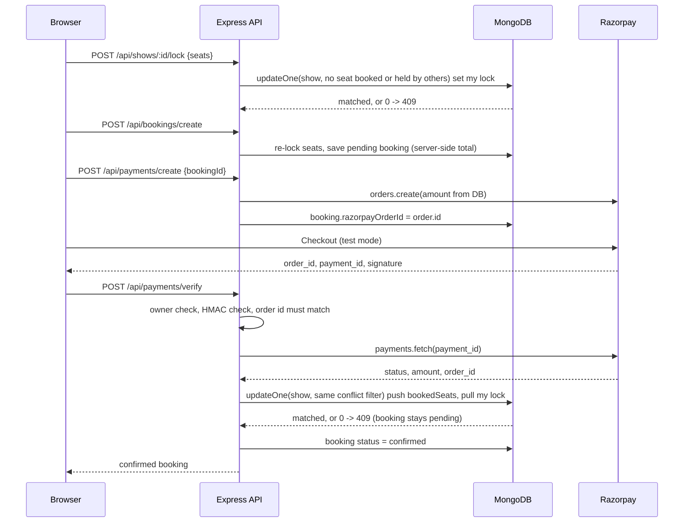

# ShowTimeX

A movie ticket booking web app. Customers browse movies and showtimes, hold seats for a few minutes, pay through Razorpay (test mode) and download a ticket. Admins manage movies and shows and see revenue reports.

**What problem it solves.** When several people pick the same seat at the same time, a naive booking system lets more than one of them pay for it. ShowTimeX makes every seat write a single conditional database update, so only one request can win a seat, and it refuses to confirm a booking unless Razorpay says the payment for that exact order and amount was captured.

## Demo

- Live app: https://showtimexproject.vercel.app/
- Backend API: https://showtimex.onrender.com/ (health check: https://showtimex.onrender.com/api/health)

The backend runs on a free Render plan and may take up to a minute to wake on the first request.

| Role | Email | Password |
|---|---|---|
| Customer | demo.customer@example.com | `YOUR_DEMO_PASSWORD` |
| Admin | demo.admin@example.com | `YOUR_DEMO_PASSWORD` |

These are demo accounts with fake data only. Payments run in **Razorpay test mode only**; no money moves. Razorpay's published test card list includes Visa `4100 2800 0000 1007` with any future expiry and any CVV (verify before use at https://razorpay.com/docs/payments/payments/test-card-details/).

Screenshots:

- `docs/screenshots/home.png` – home page
- `docs/screenshots/seat-map.png` – seat map with seats held by another user
- `docs/screenshots/admin-dashboard.png` – admin revenue dashboard

## Highlights

- **Double booking is prevented by one conditional update.** Locking and confirming seats each run a single `Show.updateOne` whose filter rejects the document if any requested seat is already booked or held by someone else. Two concurrent requests for the same seat get exactly one success; the other gets 409. See [backend/utils/seatLocks.js](backend/utils/seatLocks.js) (`seatConflictFilter`, `acquireSeatLock`, `confirmSeats`) and the proof in [backend/tests/booking.concurrency.test.js](backend/tests/booking.concurrency.test.js).
- **Payment verification is bound to the booking.** The server creates the Razorpay order from the stored amount, saves the order id on the booking, checks the HMAC-SHA256 signature, then fetches the payment from Razorpay and requires the same order id, status `captured` and the exact amount in paise before writing seats. See `verifyPayment` in [backend/controllers/bookingController.js](backend/controllers/bookingController.js) and [backend/tests/payment.binding.test.js](backend/tests/payment.binding.test.js).
- **Bookings are private to their owner.** Reading, cancelling, creating a payment order and verifying a payment all return 403 for anyone else; admins can read. See [backend/tests/payment.authz.test.js](backend/tests/payment.authz.test.js) and [backend/tests/booking.flow.test.js](backend/tests/booking.flow.test.js).
- **Prices are never trusted from the client.** Totals are computed from the show price in the database plus fee and tax in [backend/models/Booking.js](backend/models/Booking.js).
- **51 tests run in CI** with the built-in `node:test` runner, `supertest` and an in-memory MongoDB; Razorpay is stubbed. The workflow is [.github/workflows/ci.yml](.github/workflows/ci.yml).

## Tech stack

- Frontend: React 18, Vite, React Router, Tailwind CSS, Framer Motion, Recharts, @react-pdf/renderer
- Backend: Node 20, Express 4, Mongoose 8, express-validator, jsonwebtoken, bcryptjs, helmet, express-rate-limit
- Database: MongoDB
- Payments: Razorpay (orders, signature verification, payment fetch)
- Tooling: node:test, supertest, mongodb-memory-server, Docker, docker-compose, GitHub Actions, ESLint

## Architecture

The frontend is a single-page app that talks to the Express API with a JWT in the `Authorization` header. The API keeps seat state inside each show document (`bookedSeats` and time-limited `seatLocks`), which is what allows a single-document conditional update to settle seat conflicts.

```
backend/
  app.js            Express app (no listen, no .env) – imported by tests
  server.js         loads .env, connects MongoDB, listens
  config/db.js      connection and ensureDB()
  routes/           auth, movies, shows, bookings, payments, admin, tmdb
  controllers/      request handlers
  middleware/       protect (JWT), adminOnly, optionalAuth
  models/           User, Movie, Show, Booking
  utils/            seatLocks, razorpay, strings, logger, sendEmail
  tests/            node:test suite
  seed.js           idempotent demo seed
frontend/
  src/pages/        visitor, customer, admin pages
  src/components/   booking (seat map, ticket PDF), admin charts, UI
  src/context/      auth, booking, theme
  src/services/     axios client and API wrappers
docker-compose.yml  api + mongo + redis
```

### Booking flow



## Notable decisions

**Seat conflicts are settled by the database, not by application code.** Each write carries a `$nor` filter over the requested seats: none may be in `bookedSeats`, and none may be in another user's `seatLocks` entry with a future `expiresAt`. MongoDB applies filter and update atomically per document, so no transaction or Redis lock is needed for a single show.

**The booking is saved as confirmed only after the seat write succeeded.** If the seat update does not match, verify returns 409 and the booking stays pending. The reverse failure (seat written, booking save fails) is logged with booking and payment ids for manual reconciliation and is listed under limitations.

**Verification is stricter than a signature check.** A valid signature only proves the order/payment pair came from Razorpay. Comparing the order id to the one stored on the booking, and the fetched amount to the stored total, stops a cheap payment from confirming an expensive booking.

**app.js is separate from server.js.** Tests import the app with an in-memory MongoDB already connected and never read `.env`, so the suite cannot reach a real database or gateway.

**Posters are URLs, not uploads.** The API runs on read-only serverless filesystems, so images come from TMDB lookup or a pasted link.

## Features

- Register, login, profile update; OTP-based password reset by email
- Browse now-showing and coming-soon movies, search, filter by genre and language
- Showtimes per movie and date; seat map with booked and held seats
- Seat holds with a countdown (default 10 minutes), server-enforced 10-seat cap and a 60-minute cutoff before showtime
- Razorpay checkout, server-side verification, ticket PDF with a QR of the booking id
- Cancel a booking; refund eligibility recorded by tier (90% / 70% / 50% by hours before the show) for an admin to approve or decline
- Admin: manage movies and shows (bulk schedule across dates and time slots), all bookings with filters and pagination, user insights, revenue and ticket reports with period-over-period change, resend ticket email
- Optional n8n webhooks for booking, refund and new-movie events
- Security: helmet, CORS allow-list, rate limiting on auth and OTP routes, escaped regex search, generic 500 responses

## API

All paths are under `/api`. "user" means a valid JWT; "owner" means the booking's user.

| Method | Path | Auth | Purpose |
|---|---|---|---|
| POST | /auth/register, /auth/login | public, rate limited | Register, login |
| POST | /auth/forgotpassword | public, rate limited | Send OTP |
| PUT | /auth/resetpassword | public, rate limited | Reset with OTP |
| GET | /auth/profile | user | Current user |
| PUT | /auth/update-profile | user | Update name, phone, password |
| GET | /movies, /movies/:id, /movies/search, /movies/now-showing, /movies/coming-soon | public | Catalogue |
| POST, PUT, DELETE | /movies, /movies/:id | admin | Manage movies |
| GET | /shows, /shows/:id, /shows/movie/:movieId | public | Showtimes and seat state |
| POST, PUT, DELETE | /shows, /shows/:id | admin | Manage shows |
| POST | /shows/:id/lock, /shows/:id/unlock | user | Hold or release seats |
| POST | /bookings/create | user | Create pending booking |
| GET | /bookings/user | user | My bookings |
| GET | /bookings/:id | owner or admin | One booking |
| DELETE | /bookings/:id/cancel | owner | Cancel |
| GET | /bookings | admin | All bookings |
| POST | /payments/create | owner | Create Razorpay order |
| POST | /payments/verify | owner | Verify payment, confirm seats |
| GET | /admin/stats, /admin/reports, /admin/bookings, /admin/users | admin | Reports |
| PATCH | /admin/bookings/:id/refund | admin | Approve or decline refund (status only) |
| POST | /admin/bookings/:id/resend-ticket | admin | Resend ticket via n8n |
| GET | /tmdb/search?title= | public | Poster lookup proxy |
| GET | /health | public | Liveness |

## Environment variables

Backend, from [backend/.env.example](backend/.env.example):

| Name | Required | Purpose |
|---|---|---|
| MONGO_URI | yes | MongoDB connection string |
| JWT_SECRET, JWT_EXPIRE | yes, no | Token signing; expiry defaults to 7d |
| CLIENT_URL | yes | Frontend origin for the CORS allow-list, e.g. `https://showtimexproject.vercel.app`, no trailing slash; several origins may be comma-separated |
| RAZORPAY_KEY_ID, RAZORPAY_KEY_SECRET | yes | Test-mode keys |
| TMDB_API_KEY | no | Poster lookup |
| SMTP_HOST, SMTP_PORT, SMTP_EMAIL, SMTP_PASSWORD, FROM_NAME, FROM_EMAIL | no | OTP email; without SMTP_HOST an Ethereal test inbox is used |
| N8N_WEBHOOK_URL | no | Automation hooks |
| SEED_ADMIN_PASSWORD, SEED_CUSTOMER_PASSWORD | seed only | Demo account passwords |
| PORT, NODE_ENV | no | Defaults 5000, development |
| SEAT_LOCK_MINUTES, MIN_BOOKING_LEAD_MINUTES, SHOW_TIMEZONE_OFFSET_MINUTES | no | Defaults 10, 60, 330 |
| AUTH_RATE_LIMIT_MAX, AUTH_RATE_LIMIT_WINDOW_MINUTES | no | Defaults 20, 15 |
| REDIS_URL | no | Provisioned by docker-compose; not used by the API yet |

Frontend, from [frontend/.env.example](frontend/.env.example):

| Name | Required | Purpose |
|---|---|---|
| VITE_API_BASE_URL | yes | API base, ending in `/api` |
| VITE_RAZORPAY_KEY | yes | Razorpay publishable key id; there is no fallback |

## Getting started

With Docker (API, MongoDB and Redis):

```bash
cp backend/.env.example backend/.env    # set JWT_SECRET, RAZORPAY_*, CLIENT_URL
docker compose up --build
docker compose ps                        # api, mongo, redis report "healthy"
curl http://localhost:5000/api/health
```

The compose file points `MONGO_URI` and `REDIS_URL` at its own services. Run the frontend separately with `VITE_API_BASE_URL=http://localhost:5000/api`.

Without Docker:

```bash
cd backend && npm install && cp .env.example .env && npm run dev      # http://localhost:5000
cd frontend && npm install && cp .env.example .env && npm run dev     # http://localhost:5173
```

Seed the demo accounts:

```bash
cd backend
npm run seed:users                                                    # dry run, writes nothing
SEED_ADMIN_PASSWORD=... SEED_CUSTOMER_PASSWORD=... npm run seed:users -- --confirm
```

`seed:users` upserts only the two demo accounts and never touches movies, shows or bookings; movies and shows are added through the admin panel. Running it again updates the same two users and creates nothing. The full `npm run seed -- --confirm` additionally creates fictional movies, shows and bookings for local development; both modes dry-run by default and read passwords only from the two `SEED_*` variables.

## Testing and CI

```bash
cd backend && npm test        # 51 tests, about 10 seconds, no Docker or external services
cd frontend && npm run lint && npm run build
```

Tests use `node:test`, `supertest` and `mongodb-memory-server`; the Razorpay client in [backend/utils/razorpay.js](backend/utils/razorpay.js) is stubbed. Covered: two parallel confirmations and two parallel locks for one seat, wrong-owner 403s, bad signature, order mismatch, amount mismatch and non-captured status, gateway failure leaving the booking pending, regex metacharacters in search, CORS allow-list, helmet headers, rate limiting, generic 500 bodies, auth flows, IDOR on read and cancel, admin route protection, seed dry-run and idempotency, users-only seed with real login.

CI ([.github/workflows/ci.yml](.github/workflows/ci.yml)) runs the backend tests with a Redis service container and the frontend lint and build, each job limited to 10 minutes.

## Known limitations

- No Razorpay webhook. Confirmation depends on the browser calling `/api/payments/verify` after checkout; if the tab closes first, the booking stays pending and must be reconciled by hand.
- If a seat hold expires and another user takes the seat before the payment is verified, verify returns 409, no seats are written, and the customer must be refunded manually.
- Refunds are status-only. Approving a refund updates the booking; no Razorpay refund API call is made.
- If the booking save fails right after the seat update succeeded, the seats are booked without a confirmed booking. This is logged for manual reconciliation and not covered by tests.
- QR codes are plain booking ids from a third-party image service; they are not signed and there is no scan endpoint.
- Rate limiting is in-process memory, so it is per instance. The Redis service in docker-compose is provisioned but unused.
- The TMDB proxy route has no authentication.
- Razorpay is used in test mode only.

## Roadmap

- Razorpay webhook with signature verification and idempotent confirmation
- Real refunds through the Razorpay refund API
- Redis read-through cache for public movie and show lists
- Redux Toolkit for client state
- Signed QR tickets with an admin scan endpoint that marks a ticket used once

## Author

**Hadiya Jay** · GitHub [jayy-codes07](https://github.com/jayy-codes07) · LinkedIn [hadiya-jay-b48aa8325](https://www.linkedin.com/in/hadiya-jay-b48aa8325) · hadiyajay2010@gmail.com
