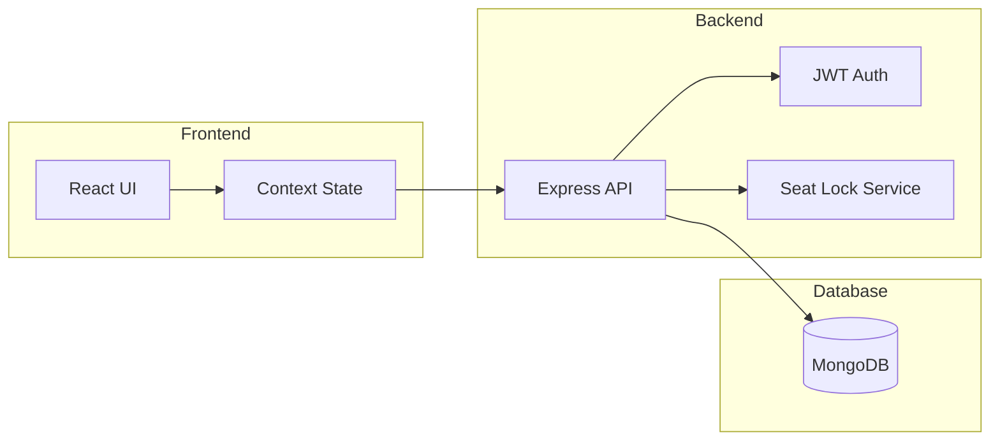
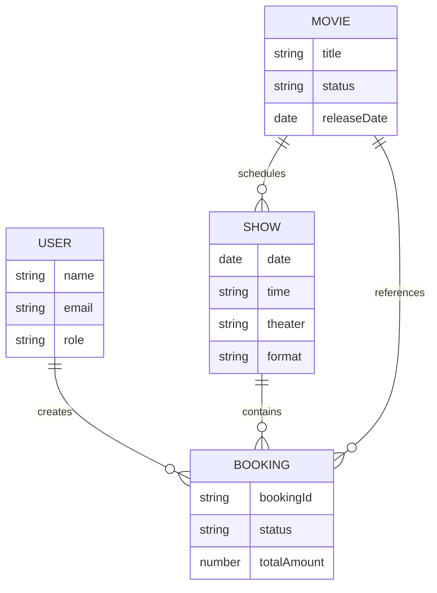
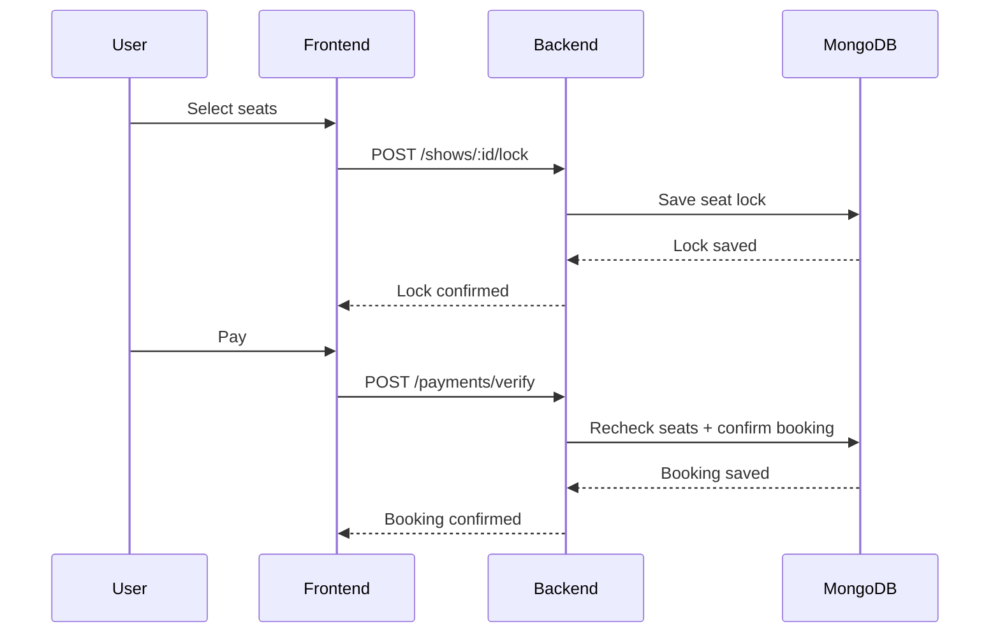

# System Diagrams

## Architecture

```mermaid
flowchart LR
  subgraph Frontend
    UI[React UI]
    Store[Context State]
  end

  subgraph Backend
    API[Express API]
    Auth[JWT Auth]
    Locks[Seat Lock Service]
  end

  subgraph Database
    Mongo[(MongoDB)]
  end

  UI --> Store
  Store --> API
  API --> Auth
  API --> Locks
  API --> Mongo
```

## ER Diagram

```mermaid
erDiagram
  USER ||--o{ BOOKING : creates
  MOVIE ||--o{ SHOW : schedules
  SHOW ||--o{ BOOKING : contains
  MOVIE ||--o{ BOOKING : references

  USER {
    string name
    string email
    string role
  }

  MOVIE {
    string title
    string status
    date releaseDate
  }

  SHOW {
    date date
    string time
    string theater
    string format
  }

  BOOKING {
    string bookingId
    string status
    number totalAmount
  }
```

## Booking Flow (Sequence)

```mermaid
sequenceDiagram
  participant U as User
  participant FE as Frontend
  participant BE as Backend
  participant DB as MongoDB

  U->>FE: Select seats
  FE->>BE: POST /shows/:id/lock
  BE->>DB: Save seat lock
  DB-->>BE: Lock saved
  BE-->>FE: Lock confirmed

  U->>FE: Pay
  FE->>BE: POST /payments/verify
  BE->>DB: Recheck seats + confirm booking
  DB-->>BE: Booking saved
  BE-->>FE: Booking confirmed
```
