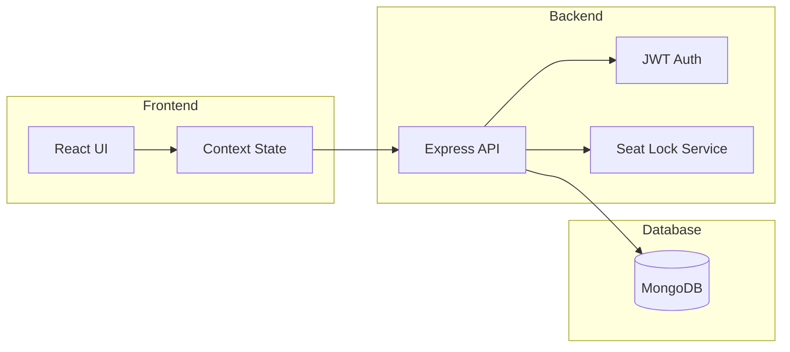
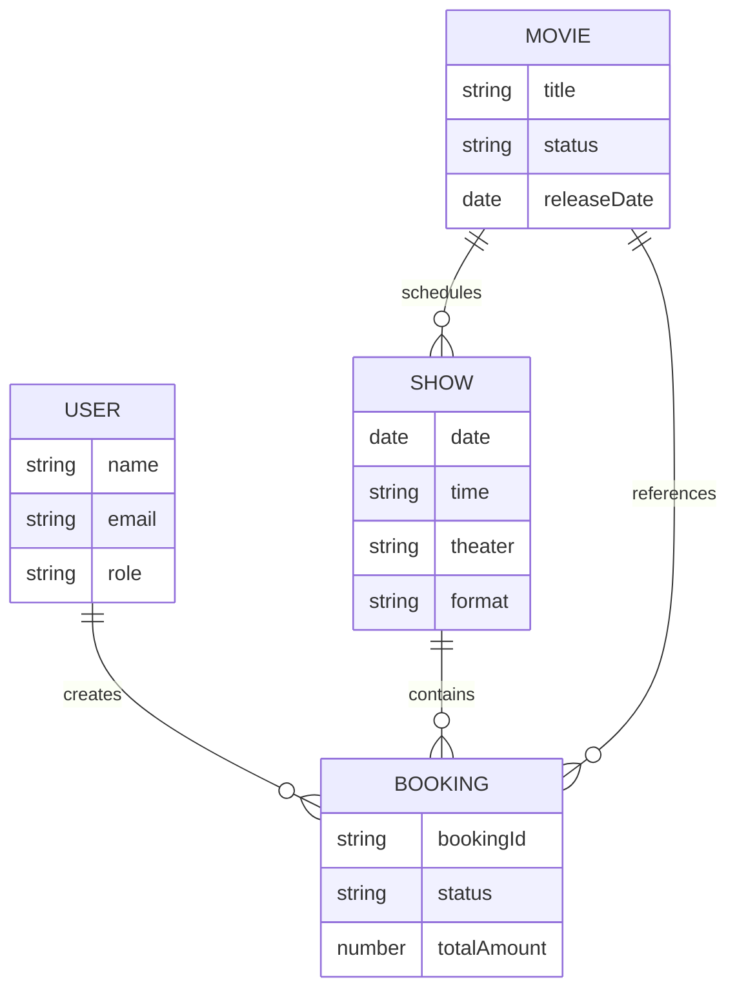

# System Diagrams

## Architecture

## ER Diagram

## Booking Flow (Sequence)

The up-to-date sequence diagram (lock → create booking → Razorpay order →
checkout → verify with order/amount binding → atomic seat write) lives in
the README under "Architecture and booking flow".
